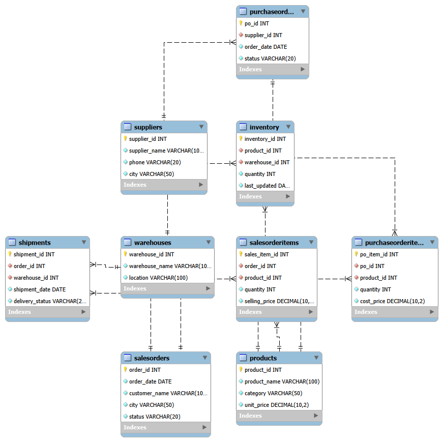
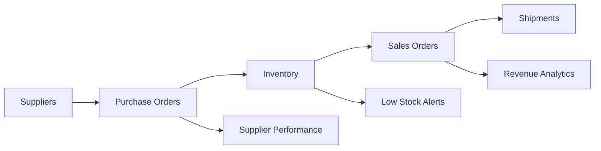

# Inventory Management System (SQL)

<p align="center">
  
</p>

<div align="center">
  
  
  
  
</div>

A complete SQL-based inventory and supply chain management system designed to handle suppliers, products, warehouses, stock levels, purchase orders, sales orders, and shipment tracking. The project focuses on real-world inventory operations, stock monitoring, and business intelligence reporting.

## Overview

This project simulates a practical inventory ecosystem for a retail or distribution business. It helps track stock movement, supplier performance, revenue trends, and delivery efficiency using structured SQL queries and database analysis.

The system is intended to answer business questions such as:

- Which products are selling the most?
- Which product categories generate the most revenue?
- Which items are at risk of stockouts?
- Which suppliers are performing well?
- Are monthly sales improving or declining?
- How effective is the delivery process?

## Why This Project Matters

Efficient inventory management is critical for reducing waste, avoiding shortages, increasing profitability, and improving customer satisfaction. This database system provides an analytical foundation for operational decision-making in supply chain management.

## Features

- Supplier and warehouse management
- Product and inventory tracking
- Purchase order and sales order processing
- Shipment and delivery status monitoring
- Low-stock and stock shortage detection
- Supplier performance ranking
- Monthly revenue analysis
- Product category revenue reports
- Business insights through SQL analytics

## Database Schema

The project includes the following core tables:

- Suppliers
- Products
- Warehouses
- Inventory
- PurchaseOrders
- PurchaseOrderItems
- SalesOrders
- SalesOrderItems
- Shipments

## System Flow



## Project Structure

```text
Inventory-Management-System_SQL/
├── README.md
├── Diagram.png
├── Monthly revenue.png
├── revenue by category.png
├── top selling products.png
├── low stock alert.png
├── stock shortage detection.png
├── supplier performance ranking.png
├── delivery performance.png
├── delivery success rate%.png
├── queries.analysis.sql
├── database/
│   ├── schema.sql
│   ├── data.sql
│   └── ...
└── ...
```

## Key SQL Business Analysis

The project includes business-focused SQL queries for:

- Top selling products
- Revenue by category
- Stock shortage detection
- Low stock alerts
- Supplier performance ranking
- Monthly revenue trends
- Delivery performance
- Delivery success rate

## Screenshots

### Entity Relationship Diagram


### Top Selling Products


### Revenue by Category


### Monthly Revenue


### Stock Shortage Detection


### Low Stock Alerts


### Supplier Performance Ranking


### Delivery Performance


### Delivery Success Rate


## Business Insights

The SQL analysis helps uncover actionable insights such as:

- Strong revenue contribution from specific product categories
- Seasonal or monthly revenue growth patterns
- Items running low and needing quick restocking
- Supplier dependence and supplier reliability
- Delivery delays and performance issues affecting customer satisfaction

## Setup Instructions

### Prerequisites

- MySQL or compatible SQL database
- MySQL Workbench or any SQL client
- Database files from the project

### Steps

1. Create the database schema from the SQL scripts in the `database/` folder.
2. Insert sample data.
3. Run the analysis queries from `queries.analysis.sql`.
4. Explore the output reports and visualized insights.

```sql
-- Example query
SELECT product_name, SUM(quantity) AS total_quantity_sold
FROM SalesOrderItems soi
JOIN Products p ON soi.product_id = p.product_id
GROUP BY product_name
ORDER BY total_quantity_sold DESC;
```

## Technologies Used

- SQL
- MySQL
- MySQL Workbench
- Database modeling and ERD design
- Business analytics queries

## Use Cases

This project is suitable for:

- Retail inventory management
- Warehouse operations
- Distribution planning
- Supplier evaluation
- Sales forecasting support
- Operational analytics dashboards

## Conclusion

This Inventory Management System SQL project demonstrates how relational database design and SQL analysis can support real-world business decisions. It transforms operational sales, inventory, and logistics data into meaningful insights for improved planning and performance.

## Author

Ashka Singh

---

<p align="center">
  <strong>Built for streamlined inventory operations and data-driven decision making.</strong>
</p>
